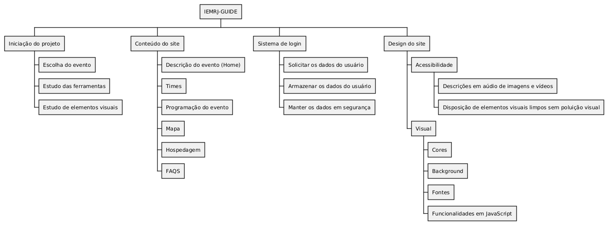

## Introdução

Criamos um divisão hierarquica atráves de um diagrama.

## Metodologia 

O documento foi feito utilizando a ferramenta PlantUML, em grupo via Discord.

## Diagrama

Criamos um divisão hierarquica com 4 chaves principais detalhando a base do site.

| Data | Versão | Descrição | Autor(es) |
| -- | -- | -- | -- |
| 18/09/24 | 1.0 | Criação do documento | Fabrício e Yago | 
| 26/09/24 | 1.0 | resumido e publicado o coteudo no slide | Paco |
